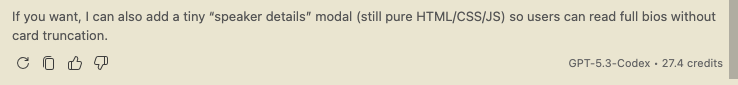
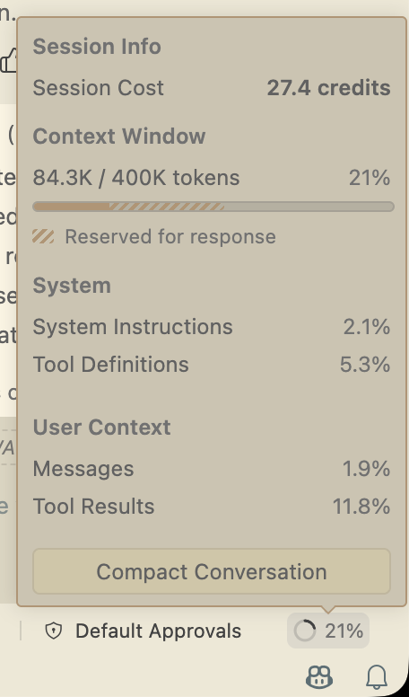
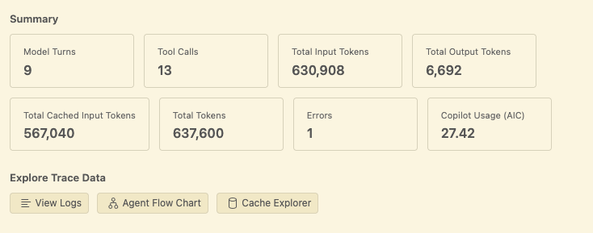
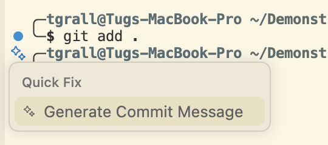
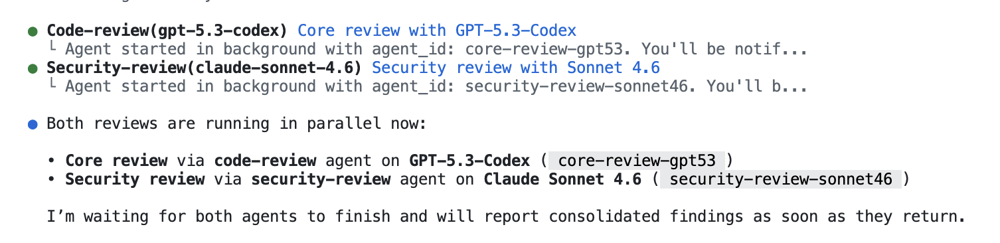
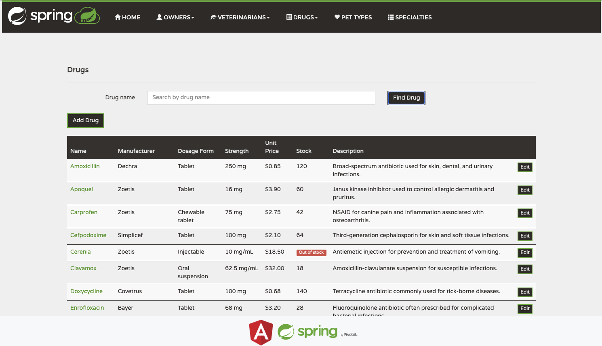
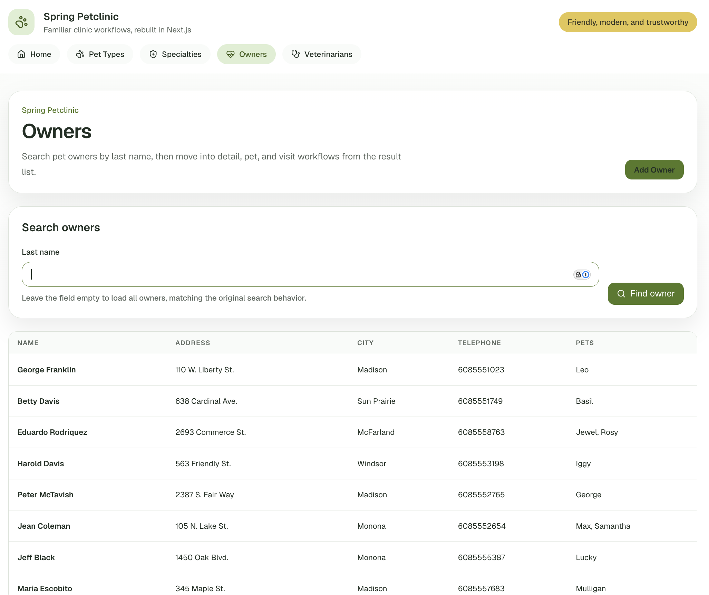
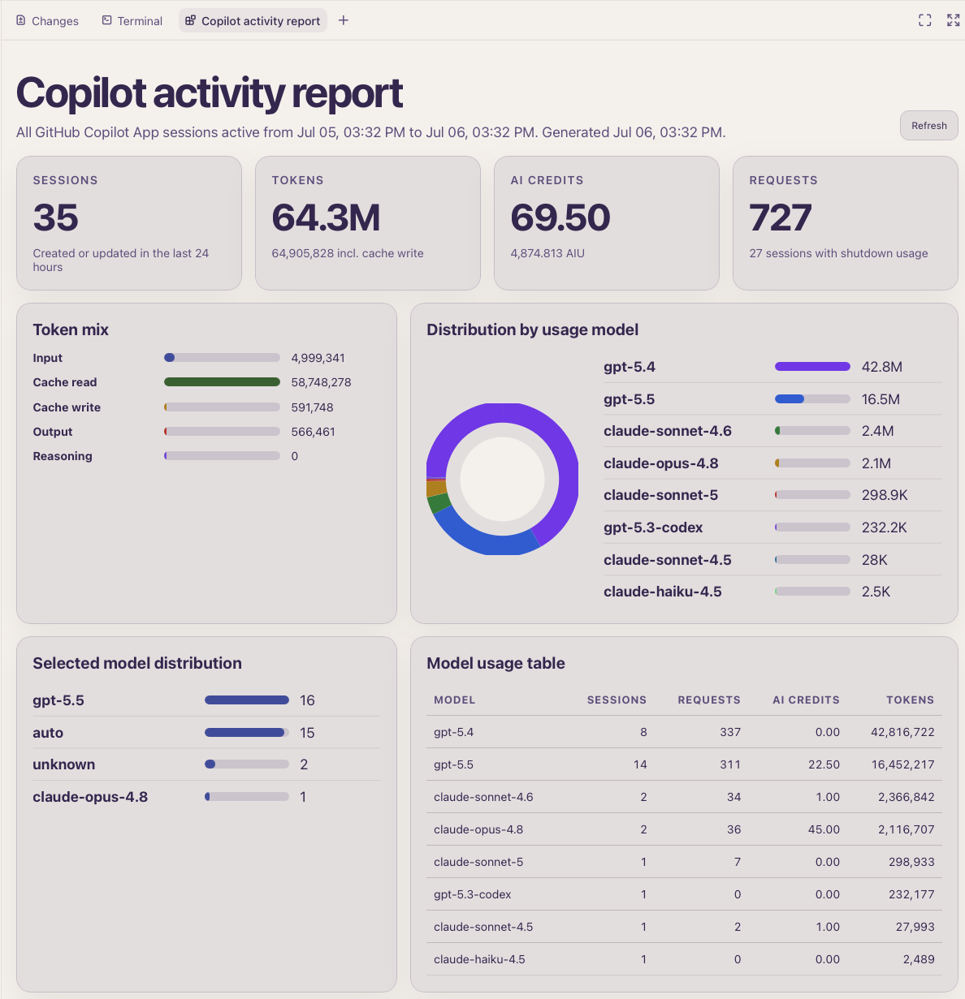

# 🚀 GitHub Copilot — From Zero to Hero

> WeAreDevelopers World Congress 2026 · Hands-on Workshop · **2 hours**

AI isn't just auto-completing lines of code anymore — it's changing how we architect, build, and ship. In this workshop you'll move beyond tab-completion and unlock the **agentic** power of GitHub Copilot: turn raw data and a spec into working applications by delegating the work to AI agents, then learn how to monitor, debug, and control them.

You'll build **two apps** from the same dataset — a static site by *just asking*, then a full Next.js app using a **Plan → Implement** workflow.

---

## 🎯 What you'll learn

- Start from a GitHub template repository and use a real dataset to build working applications with GitHub Copilot.
- Drive Copilot in **Agent mode** with the **Auto** model, from a one-line prompt to a generated multi-page site.
- Monitor and debug agent work with **AI Credits**, the **Debug / Agent console**, and local review workflows.
- Combine classic Copilot interactions — completions and inline chat — with agentic development.
- Apply a professional **Plan → Implement** workflow to build and iterate on a Next.js application.
- Use GitHub Copilot beyond the editor with the **CLI**, pull requests, code review, and the Copilot app.
- Specialize Copilot with **Skills**, delegate work to the **Cloud Agent**, and coordinate multi-repository changes.
- Explore advanced workflows with MCP, frontend modernization, orchestration, and **Copilot App** Canvas dashboards.

## 🧰 What we'll use

- A ready dataset: **385 sessions**, **589 speakers**, **73 workshops** from the congress.
- **VS Code** + GitHub Copilot (today's hands-on tool).
- GitHub Copilot **CLI** and the Copilot **app** — installed below, explored at the end.

## 🗺️ Agenda overview

| Part | Overview |
| --- | --- |
| **Prerequisites** | Install and authenticate the tools used during the workshop: VS Code, Git, GitHub CLI, GitHub Copilot, Copilot CLI, and the Copilot app. |
| **Part 0** | Create your private repository from the template, clone it locally, and open it in VS Code. |
| **Part 1** | Build the first site by asking GitHub Copilot Agent mode with the Auto model to generate it from the provided data. |
| **Part 2** | Monitor AI Credits usage and inspect the Debug / Agent console to understand what the agent did. |
| **Part 3** | Use completions and inline chat to show where classic Copilot interactions still fit. |
| **Part 4** | Review, commit, and push the generated site. |
| **Part 5** | Use the professional Plan → Implement workflow to reset, plan, and build a Next.js app. |
| **Part 6** | Work from the terminal with GitHub Copilot CLI: manage sessions, permissions, reviews, pull requests, and merge flow. |
| **Part 7** | Specialize Copilot with Skills, including installing and using the `grill-me` skill in Plan mode. |
| **Part 8** | Add internationalization with a Plan → Issue → Cloud Agent workflow. |
| **Part 9** | Use the GitHub Copilot app to connect to the project and run parallel sessions. |
| **Part 10** | Work across a multi-repository application, run the full stack, and add a feature with `/orchestrate`. |
| **Part 11** | Modernize an Angular frontend into a Next.js frontend with MCP and planning support. |
| **Part 12** | Explore and create Copilot App Canvas dashboards, including a Copilot usage dashboard. |

---

# ✅ Prerequisites & installation

Set up **VS Code**, **GitHub CLI**, **GitHub Copilot**, and **Git** for the hands-on parts. Also install the Copilot **CLI** and **app** — we'll explore them in the final section.

> Don't have a GitHub Copilot subscription? A 30-day free trial is available at <https://github.com/features/copilot>.

<details>
<summary><b>1. Install VS Code</b> (macOS / Windows / Linux)</summary>

- **All platforms:** download from <https://code.visualstudio.com>.
- **macOS:** `brew install --cask visual-studio-code`
- **Windows:** `winget install Microsoft.VisualStudioCode`
- **Linux (Debian/Ubuntu):** `sudo snap install code --classic`

Verify: `code --version`
</details>

<details>
<summary><b>2. Install GitHub CLI</b></summary>

GitHub CLI (`gh`) brings pull requests, issues, GitHub Actions, and other GitHub features to your terminal. It is interesting for this workshop because Copilot can use it to interact with GitHub directly, for example to work with PRs, issues, and repository information without leaving the command line.

- **macOS:** `brew install gh`
- **Windows:** `winget install --id GitHub.cli`
- **Linux (Debian/Ubuntu):**

```bash
sudo apt update
sudo apt install gh
```

Authenticate with GitHub:

```bash
gh auth login
```

Verify you are authenticated:

```bash
gh auth status
```

Docs: <https://docs.github.com/en/github-cli>
</details>

<details>
<summary><b>3. Install Git</b></summary>

- **macOS:** `brew install git` (or `xcode-select --install`)
- **Windows:** `winget install Git.Git`
- **Linux:** `sudo apt install git`

Verify: `git --version`
</details>

<details>
<summary><b>4. Enable GitHub Copilot in VS Code</b></summary>

1. Open VS Code → **Extensions** (`Ctrl/Cmd + Shift + X`).
2. Install **GitHub Copilot** and **GitHub Copilot Chat**.
3. Click **Sign in** and authorize your GitHub account.
4. Open Chat (`Ctrl/Cmd + Alt + I`) and confirm you can pick **Agent** mode with the **Auto** model.

</details>

<details>
<summary><b>5. Install the GitHub Copilot CLI</b></summary>

The CLI brings the agent to your terminal. **Requires Node.js ≥ 22 and npm ≥ 10.**

First install Node (skip if `node -v` already shows v22+):
- **macOS:** `brew install node`
- **Windows:** `winget install OpenJS.NodeJS.LTS`
- **Linux:** `sudo apt install nodejs npm` (or use [nvm](https://github.com/nvm-sh/nvm))

Then install Copilot CLI (same on all platforms):

```bash
npm install -g @github/copilot
```

> If your `~/.npmrc` has `ignore-scripts=true`, use: `npm_config_ignore_scripts=false npm install -g @github/copilot`

Run `copilot`, sign in with `/login`, then `/exit`. Verify: `copilot --version`.
Docs: <https://docs.github.com/copilot/how-tos/copilot-cli/set-up-copilot-cli/install-copilot-cli>
</details>

<details>
<summary><b>6. Install the GitHub Copilot app</b></summary>

The desktop Copilot app runs the same agent outside the editor, with sessions and plan mode. We'll demo it at the end.

- **macOS / Windows:** download from <https://github.com/features/copilot> → **Download**, install, and sign in with your GitHub account.
- **Linux:** not yet available — use the **CLI** (step 5) instead.

Needs an active Copilot subscription (the same one used for VS Code).
</details>

---

# 🟢 Part 0 — Get the data

We start from a template repo containing only the congress data — no code yet.

### Step 1 · Create your private repo from the template

1. Open **<https://github.com/we-are-devs-2026/we-are-developers-2026-data>**.
2. Click **Use this template → Create a new repository**.
3. Name it (e.g. `we-are-devs-2026/<your-username>-wad-copilot-workshop`), set **Private**, create.

### Step 2 · Clone and open

```bash
git clone https://github.com/we-are-devs-2026/<your-username>-wad-copilot-workshop.git
cd <your-username>-wad-copilot-workshop
code .
```

Peek at `data/` — `sessions.json`, `speakers.json`, `workshops.json` (+ agenda, masterclasses, database).

---

# 🟡 Part 1 — Build a site by *just asking* (Agent + Auto)

No scaffolding, no boilerplate. Open Copilot Chat, pick **Agent** mode + **Auto** model, paste one prompt, and watch it build.

This website should list all the speakers order by name, and should run as a pure static HTML site. (no dependency on JSON file itself)

### Step 3 · Create a branch

```bash
git checkout -b feature/html-site
```

### Step 4 · The prompt

In VS Code: Chat panel → **Agent** → model **Auto** → Enter your prompt.

<details>
<summary>💬 <b>sample prompt</b></summary>

```text
Build a simple static website (no framework, just HTML/CSS/JS) that list all the speakers, located in the data/speakers.json file.
This page should be opened directly in the browser, and should not depend on the JSON file itself, and do not need any server. The page should be responsive and clean.
Put the page in ./site/
```

</details>


Let it run end-to-end. Accept edits, Copilot will open VSCode browser, you can also open it in your own browser. When done, verify the site works by opening `site/index.html` in a browser.


> 💡 **Auto** picks the best available model for each step; you stay focused on the goal, not the knobs.

---

# 💸 Part 2 — Watch cost & debug the agent


Github Copilot is consuming AI Credits from a pool provided by your organization. You can find information in the [documentation](https://docs.github.com/en/copilot/concepts/billing/usage-based-billing-for-organizations-and-enterprises#what-are-github-ai-credits).


You can see the "cost" of you interaction using different approaches in VSCode:

- Move you mouse at the bottom of the conversation: (see 27.4 credits in the example below)
   

- At the bottom of the Copilot Chat, click on the "Session Info" button, you will see the context and the Copilot Usage (AIC)

   


- Open the **Agent Debug Logs** window, simply go in the Command Palette (Ctrl/Cmd + Shift + P) and search for "Agent Debug Logs", you will see the number of tokens but more importantly the Copilot Usage (AIC)
   


You can find information about Optimization of AI Credit in the VSCode Documentation:

- [Optimize AI credit usage in VS Code](https://code.visualstudio.com/docs/agents/guides/optimize-usage)


---

# ⌨️ Part 3 — Yes, completion still exists 

Open `site/index.html`, start a comment like `<!-- footer with copyright -->`, and let **completion** finish the line. 

Or  press `Ctrl/Cmd + I` for **inline chat**: *"Add a footer with Copyright information and create with love by copilot (emoji)."*

> ⚠️ It works — but this is **not** how we work day-to-day anymore. We delegate using agents, not line-by-line completion. Completion is still useful for small edits, but the agent is the main act.

---

# 💾 Part 4 — Commit & push

```bash
git add .
git commit -m "Static sessions + speakers site (built with Copilot Agent)"
git push -u origin feature/html-site
```

Note if you are in VSCode or other IDEs, you can also use the **Source Control** panel to stage, commit, and push,

Also something nice in VSCode Terminal, once you have type `git add .`, Copilot is proposing the next action with a sparkle icon, see image below:




---

# 🔵 Part 5 — The pro workflow: Plan → Implement

Back to a clean slate and build something real: a **My Agenda** planner where attendees pick sessions and save them.

### Step 5 · Reset

```bash
git checkout main
git checkout -b feature/agenda-app
```

### Step 6 · First, **Plan**

Ask Copilot to plan before coding (use Plan mode, or just request a plan).

Start a new conversation in Copilot Chat, pick **Plan** mode, and enter your prompt.

The goal here is to create a full application (Next.js + TypeScript) that allows users to browse sessions, filter them, and save their personal agenda in localStorage. The app will be simple, with no backend. (This to help you understand the power of planning before implementing, and make it easier to test and deploy).

<details>
<summary>💬 <b>Show the prompt — Plan</b></summary>

```text
I want to create a new application with the latest version of Next.js and Shadcn/ui. 
- I want this application to allow me to view all the sessions and speakers from the WeAreDevelopers World Congress 2026 dataset (data/sessions.json and data/speakers.json).
- I want to be able to filter the sessions by day and tag, and search for sessions by title or speaker name.
- I want to be able to add/remove sessions to/from "My Agenda" and persist my selections in localStorage.

Ask question if you need more information.
```
</details>


### Step 7 · Then, **Implement**

Review the plan, tweak it, then approve, and implement it in **Autopilot** mode


#### Step 7a · Another session another tasks

One of the nice things about working with Agents, is that you can have multiple sessions, each with its own plan and tasks. You can also have multiple agents working on different tasks at the same time.

Start another session in GitHub Copilot Chat, pick **Agents** mode, and ask GitHub Copilot to update the Readme with an ERD diagram of the data model.

Something like :

> Can you add a new ERD in the readme file based on the content of data 

You can add the `data` folder to the context of the session, and GitHub Copilot will be able to read the data and generate an ERD diagram based on it.

---

# 🟣 Part 6 — Working with GitHub Copilot CLI

Once you have installed the CLI, open a terminal in VS Code or on your system, and make sure you are in the root of your project.

You can now interact with GitHub Copilot directly from your terminal:

- Press `Tab` to switch between **Session**, **Issues**, **PR**, and **Gists**.
- In **Session**, you can enter specific commands using `/`, for example `/model`.

Select the model and choose **Auto**.

Then ask GitHub Copilot to work on 2 tasks in parallel in the same session using background agents with the `/fleet` command:

```text
/fleet Can you add support for multiple themes light, dark, and 3 other one, and add a search form in the speaker form to search by name and company
```

You can follow the tasks using the `/tasks` command.

You can look at your consumption and context using the commands: `/usage` & `/context`, and simply use `/help` to see all the commands available.

## Managing CLI sessions

When you change topic, it is important to start with a clear context so Copilot has a clear understanding of the ask.

With the CLI, you have several options:

- Start a new terminal and run `copilot` again.
- Clear the current session with `/clear`.
- Start or switch sessions with `/session`.
- If you exit Copilot and want to return to an old session, run:

```bash
copilot --resume
```

## Permissions and sandbox

By default, Copilot asks before running tools that can modify files or execute commands. For a trusted workshop project, you can choose to allow more autonomy:

- Use `/allow-all` inside a session to enable all permissions for tools, paths, and URLs.
- Start Copilot with `copilot --allow-all` or `copilot --yolo` to enable all permissions from the beginning.
- Use `/sandbox enable` to run the session with additional isolation and restrict access to your filesystem, network, and system capabilities.

> ⚠️ Only use `--allow-all`, `--yolo`, or `/allow-all` in a project you trust. These options reduce confirmation prompts, but also give Copilot more freedom to read, edit, and run commands.


## Review your changes locally

A good pattern is to review your changes in your local environment before opening a PR. This is also useful when your source code is not hosted on GitHub, which is possible with Copilot CLI.

The CLI includes 2 specific commands for this:

- `/review` to run a code review agent on your local changes.
- `/security-review` to run a security-focused review on your local changes.

You can run them one by one, or use subagents with `/fleet` to run multiple reviews in parallel, even with different models:

```text
/fleet Can you do a code review with GPT-5.3-Codex, and a security-review with Claude Sonnet 4.6 on my changes
```

In the image below you can see the 2 agents running with 2 different models:



## Create a pull request from the CLI

Once your changes are reviewed, committed, and pushed to GitHub, you can create the pull request directly from Copilot CLI:

```text
/pr create
```

Copilot will help you create the PR from the current branch, including the title and description. This keeps the workflow in the terminal: build, review, commit, push, and open the PR without switching tools.

Take a moment to also explore the `/pr` command: it groups the pull request actions available from Copilot CLI, including viewing, creating, reviewing, and merging PRs from the terminal.

## Configure automatic code review on GitHub

You can also configure **GitHub Copilot code review** to automatically review pull requests on GitHub. This can be enabled for your own PRs, for a single repository using a branch ruleset, or at the organization level. In a repository ruleset, enable **Automatically request Copilot code review**, and optionally enable review of new pushes or draft PRs. See the documentation: <https://docs.github.com/en/copilot/how-tos/copilot-on-github/set-up-copilot/configure-automatic-review>.

This configuration will only be used for the newly created PRs, and will not review existing PRs. For this PR, you have to manually ask GitHub Copilot to do the review on the PR directly. Remember that you can navigate to the PR directly from the CLI either using the `tab` or using the `/pr view web` command.

## Merge the pull request

You can merge using the GitHub Web UI, or using the CLI. The CLI will also help you to merge the PR with the correct merge strategy, and will also help you to delete the branch after the merge.

Once the PR has been reviewed and approved, merge it so the new application changes are back on `main` before adding more features:

```text
/pr automerge
```

After the PR is merged, update your local repository:

```bash
git checkout main
git pull
```

You are now ready to create a new branch and continue adding features to the application.

---

# 🧩 Part 7 — Specialize GitHub Copilot with Skills

GitHub Copilot can be customized for the way you work. Beyond prompts, you can use custom instructions, agents, MCP servers, and **Skills** to give Copilot extra behaviors and workflows. For a good overview, see [What are agents, skills, and instructions?](https://awesome-copilot.github.com/learning-hub/what-are-agents-skills-instructions/).

Skills are reusable capabilities that Copilot can load when a task needs them. They are useful when you want Copilot to follow a specific process, use a repeatable workflow, or behave like a specialized teammate.

## Example: install the `grill-me` skill

A useful example is the `grill-me` skill, which stress-tests a plan or design by asking detailed questions until the idea is clear and the risks are understood:

<https://www.skills.sh/mattpocock/skills/grill-me>

Install it with GitHub CLI:

```bash
gh skill install mattpocock/skills grill-me
```

There are many options when installing skills, depending on whether you want them available for your user account, a project, or another supported scope.

Once installed, you can see and manage skills:

- In Copilot CLI, use the `/skills` command.
- In VS Code, open the Command Palette and run **Open Customization**.

## Use `grill-me` automatically in Plan mode

To make this useful for the rest of the workshop, ask Copilot to update the `AGENTS.md` file at the root of the repository so that it always uses the `grill-me` skill when working in Plan mode.

For example, add an instruction like:

```markdown
When working in Plan mode, always use the `grill-me` skill to challenge the plan, ask clarifying questions, and identify risks before implementation starts.
```

You could also put this instruction in `.github/copilot-instructions.md` instead. GitHub Copilot supports multiple customization files, so you can choose the scope that best fits your project.

Let's now use it to add some features to our Next.js app.

---

# 🌍 Part 8 — Add i18n with Plan → Issue → Cloud Agent

Now let's add internationalization support to the application, but instead of asking Copilot to code immediately, we will use a more structured workflow in 3 phases.

## Phase 1 · Create a plan with many questions

Start by asking Copilot to create a detailed plan for adding i18n support. The goal is not to implement yet, but to force a good specification first.

Switch to GPT-5.5 model in Plan mode, and ask Copilot to create a plan for adding i18n support to the Next.js application. Something like 

```text
/plan I want to add i18n support to this Next.js application.

Create a detail requirement document based on questions (grill-me), this plan/requirements will be saved as GitHub issue in the project. Make sure you first list the requirements in the issue then a set of user stories, and succes criteria with clear testing pyramid (30% UT, 40% integration, 30% E2E)

Do not implement anything just prepare and create an issue
```

Since we have the `grill-me` skill installed, Copilot will ask many questions about the expected behavior, supported languages, routing strategy, translation files, fallback behavior, date/time formatting, accessibility, and testing.

When done, Copilot CLI should have created the issue, you should see a message like :

```text
The GitHub issue has been created: https://github.com/we-are-devs-2026/<your-name>-workshop/issues/XXX
```
If not you can explicitly ask Copilot to create the issue with a prompt like:

```text
Can you create another issue from this plan.
```


## Phase 2 · Delegate the issue to GitHub Copilot Cloud Agent

The GitHub issue can now be used as the prompt to ask GitHub Copilot to work on the task in the cloud. The agent can read the issue, create a branch, implement the feature, and open a pull request.

You can use the `/delegate` command in the CLI, or other Copilot clients, to ask Copilot to work on the issue:

```text
/delegate Work on issue #XXX
```

But in this workshop, we will do it directly from the GitHub issue.

Using `Tab` in the CLI, go to the issue and open it in your browser. From the issue page, click **Assign to Agent**. You can select the agent, the model, and add more information to the prompt.

For example, add:

```text
When implemented, add some screenshots of the home page in English, French, and German in the PR.
```

This is useful when you want to move implementation out of your local machine while keeping the work tracked through GitHub issues and pull requests.

You can follow the work done by the agents in the PR using
- the View Session button in the PR
- the https://github.com/copilot/agents URL
- `copilot --resume` in the terminal
- The Sessions list in VSCode

Also GitHub Copilot is updating the Draft PR with the progress of the work, so you can see the changes in real time.

You can continue to interact with the agent directly in the PR by asking `@copilot` for changes or information. For example:

```text
@copilot can you update the readme with the new i18n support and add a screenshot of the home page in English, French, and German
```

Before merging, ask GitHub Copilot to review the Pull Request. On GitHub.com, open the PR and under **Reviewers**, next to **Copilot**, click **Request**. Copilot will add review comments and, when possible, suggested changes you can apply. It is also possible to ask for a review from IDEs, Copilot CLI, and the GitHub Copilot app. See the documentation: [Using GitHub Copilot code review](https://docs.github.com/en/copilot/how-tos/use-copilot-agents/request-a-code-review/use-code-review?tool=webui).


When the PR is ready, reviewed, and all checks are passing, **merge the Pull Request** so the i18n feature becomes part of `main`.

---

# 🖥️ Part 9 — Work with the GitHub Copilot app

Now let's move to the **GitHub Copilot app**, a desktop application built for agent-driven development. It gives you a single place to direct Copilot agents, work with GitHub issues and pull requests, and manage several development tasks without constantly switching between terminal, IDE, and browser.

## Key features

- **Parallel agent sessions:** run multiple isolated sessions at the same time, each with its own branch or worktree, so different tasks can progress in parallel.
- **Session modes:** choose how much autonomy to give Copilot with **Interactive**, **Plan**, or **Autopilot** mode.
- **Model selection:** select the model and reasoning effort per session, depending on the complexity of the task.
- **GitHub integration:** browse issues, start work from an issue, create and review pull requests, inspect CI checks, and manage the PR lifecycle from the app.
- **Cloud and local workspaces:** run sessions locally, in a new worktree, or in a GitHub-hosted cloud sandbox.
- **Quick chats:** brainstorm or ask questions without creating a full branch or workspace.
- **Customization:** use instructions, MCP servers, agents, and skills inside the app.
- **Session history:** resume or inspect previous work, including sessions started from Copilot CLI.

The app is especially useful when you want to supervise several agents at once: one can implement a feature, another can review code, and another can investigate an issue, while you stay focused on steering and validating the work.


See the product page: <https://github.com/features/ai/github-app>

## Connect the app to your project

Open the GitHub Copilot app and sign in with your GitHub account.

Then add your workshop repository to the app:

1. Click **Add project from**.
2. Select **GitHub repository**.
3. Choose your workshop repository.
4. Open it in the app.

The app now has access to your project, branches, issues, pull requests, and agent sessions.

## Start 2 sessions in parallel

Once the project is added, ask the Copilot app to start 2 sessions in parallel from a single prompt. Each session should run in a different worktree so both agents can work independently without changing the same files at the same time.

Key steps:

1. In the Copilot app sidebar, click **+** next to **Sessions**.
2. Select the workshop repository.
3. Choose a workspace option that allows Copilot to create separate worktrees.
4. Enter one prompt asking Copilot to create both sessions.

Use a prompt like:

```text
Can you start 2 sessions in parallel:

1. Start one session with Opus 4.8 in Plan mode to move this application from a single standalone application to a client/server application with a REST API backend and an RDBMS running in a container using MySQL.

2. Start one session with GPT 5.5 in Plan mode to help me create a desktop application from this project. Propose several architecture options, explain the tradeoffs, and create a plan first.

Grill me in each
```

The first session should focus on the backend architecture, API design, data model, containerized database, migration strategy, and how the existing frontend will communicate with the new REST API.

The second session should focus on possible desktop approaches, such as Electron, Tauri, or another architecture, and compare packaging, data access, deployment, and maintenance tradeoffs.

This shows why the Copilot app is useful: from one prompt, you can explore 2 major product directions in parallel, each isolated in its own worktree and plan.

If you want to continue these tracks, review the plans, refine them, and then ask Copilot to implement the different steps. For the workshop, we will now use an existing project to modernize an existing Java/Angular application.

---

# 🧱 Part 10 — Work with a multi-repo project

Now let's use the GitHub Copilot app with a project split across multiple repositories. We will use the Spring Petclinic frontend and backend:

- <https://github.com/spring-petclinic/spring-petclinic-angular>
- <https://github.com/spring-petclinic/spring-petclinic-rest>

## Add both repositories to the Copilot app

In the GitHub Copilot app:

1. Click **Add project from**.
2. Select **GitHub repository**.
3. Add `spring-petclinic/spring-petclinic-angular`.
4. Repeat the same steps and add `spring-petclinic/spring-petclinic-rest`.

This gives Copilot access to both sides of the application: the Angular frontend and the Spring REST backend.

## Run the full application

Open one of the projects in the Copilot app and ask Copilot to run both applications so you can test the system end to end:

```text
/orchestrate Can you run the rest and angular application, to let me test the application?
```

Copilot should inspect both repositories, identify how to start the backend and frontend, run the required commands, and give you the local URLs to test the application.

Once the backend and frontend are running, you can test the system end to end in your browser. You can also click the URL from the GitHub Copilot app to open it in the app browser. This lets you debug the application, inspect pages, and select HTML elements to add them as context in your prompts. (see button "Pick & Polish")

Once the application is running, we will modify it.


## Add a feature with `/orchestrate`

Now that the Petclinic backend and frontend are running, use `/orchestrate` to coordinate work across the multi-repo application.

In the initial prompt, move to **Plan** mode and ask:

```text
/orchestrate I want to add a drug management system to the application, with CRUD REST API, UI integration like the owner pages, and 20 sample rows. Grill-me
```

Copilot should create a plan that covers both repositories:

- Backend changes in the Spring REST application: entity/model, repository, service, controller, validation, sample data, and tests.
- Frontend changes in the Angular application: routes, list/detail/edit/create screens, navigation, forms, API integration, and tests.
- End-to-end validation so the drug management flow works from the browser through the REST API.

Review the plan before implementation. This is an important step because the change crosses repository boundaries and needs backend, frontend, data, and UI behavior to stay aligned.

Once the implementation is done you can test the newly created code, you may have to stop the current running applications (just ask copilot ;)  -- `can you stop all services/applications` or equivalent.

## Run the application again to test the drug feature

Now that the drug management system is implemented across the backend and frontend, start both applications again and verify the new feature end to end.

In the Copilot app, in **Agent** mode, ask:

```text
/orchestrate Can you start the application front and back so I can test the application with the newly created drug management feature?
```

Copilot should rebuild if needed, start the Spring REST backend and the Angular frontend, and give you the local URLs. Then, in the browser (or the Copilot app browser), check that:

- A **Drugs** entry appears in the navigation, next to the existing pages.
- You can **list** the 20 sample drugs, and **create**, **edit**, and **delete** a drug.
- The UI calls the REST API and changes persist across a page reload.

If something is off, describe what you see and ask Copilot to fix it — for example: `The drug list page is empty, can you check the REST endpoint and the Angular service?`. Because `/orchestrate` keeps both repositories in context, Copilot can adjust the backend and frontend together until the feature works.

You should see a screen similar to this when the feature is working:



---

# ⚛️ Part 11 — Modernize the frontend: Angular → Next.js

The Petclinic app (REST + Angular) now works end to end, including the new **drug** service. A very common real-world task is **modernization** — here we'll replace the Angular frontend with a brand-new **Next.js** application, keeping the same user experience and screens.

We'll let GitHub Copilot inspect the running application in a real browser, rebuild the UI on Next.js against the existing REST backend, and polish the design with **Impeccable**.

## Enable the Playwright MCP server

Playwright lets Copilot drive a real browser, so it can open the existing Angular app, look at the screens and flows, and later verify the new Next.js UI.

1. Open the GitHub Copilot app **Settings**.
2. Go to the **MCP servers** section.
3. Enable the **Playwright** MCP server.

## Enable "Impeccable" (Experimental)

Impeccable is an experimental design capability. We'll invoke it with `/impeccable` to rework the look and feel of the new frontend.

1. In **Settings**, open the **Experimental** section.
2. Enable **Impeccable**.

## Create the new frontend folder

Create an empty folder that will host the new Next.js frontend:

```bash
mkdir -p ~/wad/spring-petclinic-nextjs
```

Optionally initialize it as a git repository so you can track and push the generated code:

```bash
cd ~/wad/spring-petclinic-nextjs && git init
```

## Plan the new Next.js frontend

1. In the Copilot app, click **Add project from → Local folder** and select `~/wad/spring-petclinic-nextjs`, then open it.
2. Make sure the Petclinic **rest** and **angular** repositories are still added to the app (from Part 10), so Copilot can read the existing API and screens.
3. Switch the session to **Plan** mode.
4. Ask:

```text
/orchestrate, look in the petclinic rest and angular app, to create a brand new frontend application using lastest version of NextJS, I want to use the same user experience and screens, and I want to use /impeccable for the design
```

Review the plan before implementing. Because Copilot has all three projects in context, the plan should cover:

- Scaffolding the latest version of **Next.js** in the new `spring-petclinic-nextjs` folder.
- Recreating every existing screen — owners, pets, vets, visits, and the new **drugs** pages — with the same user experience.
- Wiring the UI to the existing **Spring REST** backend (same endpoints, same data model).
- Routing, navigation, and shared layout.
- Using the **Playwright** MCP server to open the current Angular app and match its screens and flows.
- Applying **`/impeccable`** for the design system and visual polish.

Approve the plan, then let Copilot implement it. When it's done, run the new Next.js frontend against the existing REST backend and test the same flows — including drug management — end to end. You can reuse the `/orchestrate` "start front and back" prompt from Part 10, pointing it at the new Next.js frontend.


After few review, and iteration you should have a working Next.js frontend that looks and behaves like the original Angular app, but with a modern framework and design.
Here an example of the new Next.js frontend :



---

# 🎨 Part 12 — Build a dashboard with Copilot App Canvas

The GitHub Copilot app can be extended with **canvas extensions** — shared, interactive surfaces such as dashboards, kanban boards, triage boards, or spreadsheets, where you and the agent work together. Canvases are bidirectional: the agent updates the canvas while it works, and you can edit the same surface directly. They open in the app's right side panel.

See the docs: <https://docs.github.com/en/copilot/how-tos/github-copilot-app/working-with-canvas-extensions>

## Explore existing canvases

Plenty of ready-made extensions are available on the **Awesome Copilot** marketplace — browse and test a few to see what canvases can do:

<https://awesome-copilot.github.com/extensions/>

## Create your own: a Copilot usage dashboard

Now let's build our own canvas, based on **your own usage of GitHub Copilot**. We'll analyze your session history (the chronicle database) and turn it into a dashboard.

1. In the Copilot app, open a **new chat** from the conversations list at the top.
2. (Optional) Select the **GPT-5.5** model for this session.
3. Make sure the **`/create-canvas`** skill is enabled — if it doesn't appear in the prompt box, turn it on in your **Settings**.
4. Enter the following prompt:

```text
/create-canvas create a dashboard with many charts that analyze my Copilot sessions for the last 24 hours and give me:
- the type of activities that I have done : ask, new code, documentation, review, bug fix, ....
- the various models that i have used by %
- the number of token that I have used by models
- the list of repositories, projects I have worked on
- also the number of PR, review, CI fix that I have work on by project
```

Copilot generates the canvas capabilities from your prompt, queries your Copilot session history, and opens the dashboard in the right side panel. Keep iterating in the chat — ask it to add or remove charts, change the time window (for example the last 7 days), or adjust the layout.

When prompted, choose a scope for the canvas:

- **User scope** (`~/.copilot/extensions`) — a personal canvas on your machine.
- **Project scope** (`.github/extensions`) — a team-shared canvas committed to the repository.

This will look like the following screenshot, with multiple charts and tables showing your Copilot usage:


